<h1 align="center">Web application for accounting of goods in warehouse</h1>

## Vision

"Web application for accounting of goods in 
warehouse"
is an application that allows you to record
information about goods that are stored 
in warehouses of enterprises.

Application should provide:

* Storing a list of products
in a database;
* Storing a list of warehouses
in a database;
* Storing a list of clients
in a database;
* Displaying a list of products ;
* Displaying a list of clients ;
* Displaying a list of warehouses ;
* Updating the list of products
(adding, deleting);
* Updating the list of clients
(adding, deleting);
* Updating the list of warehouses
(adding, deleting);
* Display of the list of shipment product ;
* Display of the list of delivery product ;
* Updating the list of shipment product
(adding, deleting);
* Updating the list of delivery product
(adding, deleting);
* Filtering by date of delivery;
* Filtering by date of shipment.

## 1. Storekeeper
### 1.1 Display list of Storekeeper
The mode is designed to view the list of Storekeeper.

<b>Main scenario</b>:
* User selects item “Storekeeper”;
* Application displays list of Storekeeper.

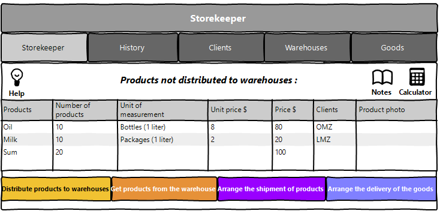

Pic. 1.1 View the storekeeper list.

The list displays the following columns:
* Products - name of the products;
* Nubmer of products - products not distributed to warehouses;
* Unit of measurement - in what value is our product measured;
* Unit price $ - price per product;
* Price $ - price for all products;
* Clients - organizations that have provided products for storage;
* Product photo - photos of our product.
### 1.2 Arrange the delivery of the goods

<b>Main scenario</b>:
* Administrator clicks the “Arrange the delivery of the 
goods” button in the storekeeper list view mode;
* Application displays form to enter delivery 
data(pic. 1.2);
* Administrator can add a customer(pic. 1.2.1) and a 
product type(pic. 1.2.2);
* Administrator enters delivery data and presses 
“Arrange the delivery of the 
goods” button;
* If any data is entered incorrectly, incorrect 
data messages are displayed(pic. 1.2.3);
* If entered data is valid, then record is adding 
to database;
* If new delivery record is successfully added,
then list of storekeeper with added records is displaying.

<b>Cancel operation scenario</b>:
* Administrator clicks the “Arrange the delivery of the 
goods” button in the storekeeper list view mode;
* Application displays form to enter delivery 
data;
* Administrator enters delivery data and 
presses “Cancel” button;
* Data don’t save in database, then list of 
storekeeper records is displaying to administrator.

Pic. 1.2 Arrange the delivery of the goods.

<b>When arrange the delivery, the following 
details are entered:</b>
* Date of delivery - date and time of delivery;
* Products - name of the products;
* Nubmer of products - products not distributed to warehouses;
* Unit of measurement - in what value is our product measured;
* Unit price $ - price per product;
* Clients - organizations that have provided products for storage;
* Product photo - photos of our product.

<b>If there is no necessary client here, you can add it yourself.</b>

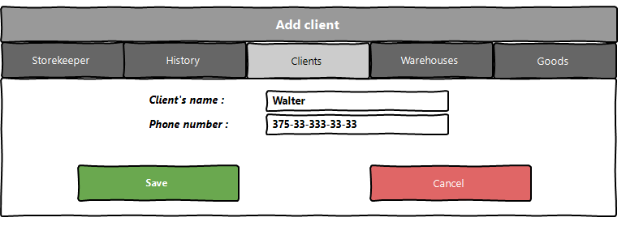

Pic. 1.2.2 Add product type.

<b>If there is no necessary type of product, then you can add it yourself.</b>

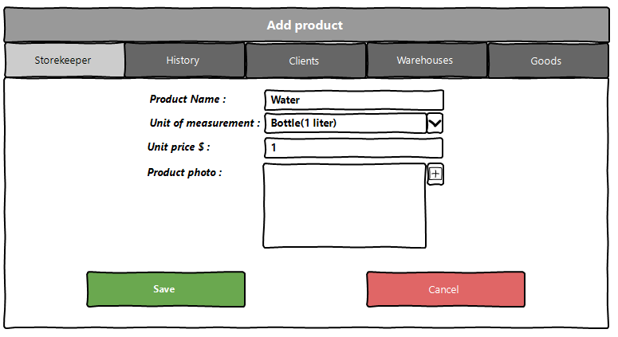

Pic. 1.2.2 Add client.

<b>If the data is entered incorrectly, it will display the corresponding error.</b>

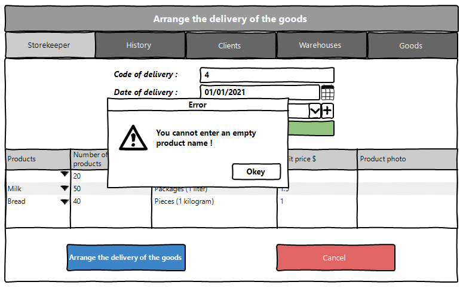

Pic. 1.2.3 Error when arrange delivery.

### 1.3 Arrange the shipment of products

<b>Main scenario</b>:
* Administrator clicks the “Arrange the shipment of products” 
button in the storekeeper list view mode;
* Application displays form to enter shipment 
data(pic. 1.3);
* Administrator enters shipment data and presses 
“Arrange the shipment of products” button;
* If any data is entered incorrectly, incorrect 
data messages are displayed(pic. 1.3.1);
* If entered data is valid, then record is adding 
to database;
* If new shipment record is successfully added,
then list of storekeeper with added records is displaying.

<b>Cancel operation scenario</b>:
* Administrator clicks the “Arrange the shipment of products”
button in the storekeeper list view mode;
* Application displays form to enter shipment 
data;
* Administrator enters delivery data and 
presses “Cancel” button;
* Data don’t save in database, then list of 
storekeeper records is displaying to administrator.

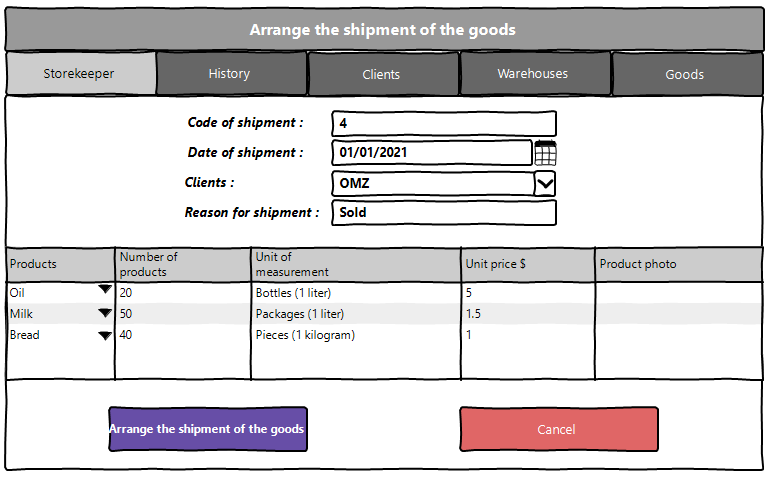

Pic. 1.3 Arrange the shipment of the goods.

<b>When arrange the shipment, the following 
details are entered:</b>
* Date of shipment - date and time of delivery;
* Reason - reason for shipment;
* Products - name of the products;
* Nubmer of products - products not distributed to warehouses;
* Unit of measurement - in what value is our product measured;
* Unit price $ - price per product;
* Price $ - price for all products;
* Clients - organizations that have provided products for storage;
* Product photo - photos of our product.

<b>If the data is entered incorrectly, it will display the corresponding error.</b>

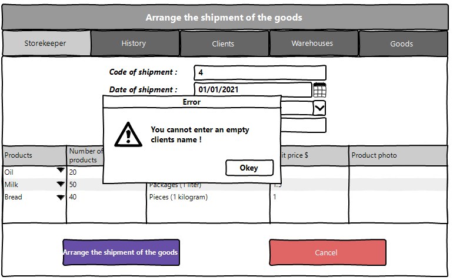

Pic. 1.3.1 Error when arrange shipment.

### 1.4 Distribute products to warehouses

<b>Main scenario</b>:
* Administrator clicks the “Distribute products to warehouses” 
button in the storekeeper list view mode;
* Application displays form to enter distribute 
data(pic. 1.4);
* Administrator enters distribute data and presses 
“Distribute products to warehouses” button;
* If entered data is valid, then record is adding 
to database;
* If new distribute record is successfully added,
then list of storekeeper, warehouses, clients and goods
with added records is displaying.

<b>Cancel operation scenario</b>:
* Administrator clicks the “Distribute products to warehouses”
button in the storekeeper list view mode;
* Application displays form to enter distribute 
data;
* Administrator enters distribute data and 
presses “Cancel” button;
* Data don’t save in database, then list of 
storekeeper, warehouses, clients and goods records is 
displaying to administrator.

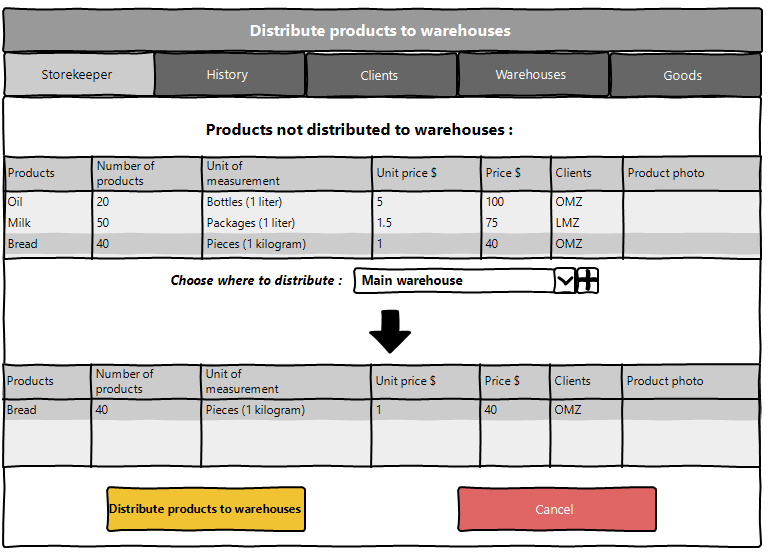

Pic. 1.4 Distribute products to warehouses.

<b>When distribute products, the following 
details is selected:</b>
* Products - name of the products;
* Nubmer of products - products not distributed to warehouses;
* Unit of measurement - in what value is our product measured;
* Unit price $ - price per product;
* Price $ - price for all products;
* Clients - organizations that have provided products for storage;
* Product photo - photos of our product;
* Warehouses - which warehouse should the products be distributed to.

<b>If there is no necessary warehouse here, you can add it yourself.</b>

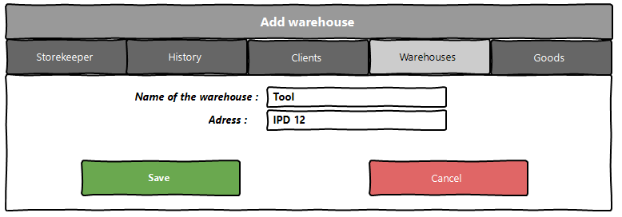

Pic. 1.4.1 Add warehouse.

### 1.5 Get products from the warehouse

<b>Main scenario</b>:
* Administrator clicks the “Get products from the warehouse” 
button in the storekeeper list view mode;
* Application displays form to enter withdrawal 
data(pic. 1.5);
* Administrator enters withdrawal data and presses 
“Get products from the warehouse” button;
* If entered data is valid, then record is adding 
to database;
* If new withdrawal record is successfully added,
then list of storekeeper, warehouses, clients and goods
with added records is displaying.

<b>Cancel operation scenario</b>:
* Administrator clicks the “Get products from the warehouse”
button in the storekeeper list view mode;
* Application displays form to enter withdrawal 
data;
* Administrator enters withdrawal data and 
presses “Cancel” button;
* Data don’t save in database, then list of 
storekeeper, warehouses, clients and goods records is 
displaying to administrator.

Pic. 1.5 Withdrawal products from warehouses.

<b>When distribute products, the following 
details is selected:</b>
* Products - name of the products;
* Nubmer of products - products not distributed to warehouses;
* Unit of measurement - in what value is our product measured;
* Unit price $ - price per product;
* Price $ - price for all products;
* Clients - organizations that have provided products for storage;
* Product photo - photos of our product;
* Warehouses - from which warehouse to withdrawal products.

## 2. History
### 2.1 Display list of history

This mode is intended for viewing and editing the history list

<b>Main scenario:</b>
* User selects item “History”;
* Application displays list of history.

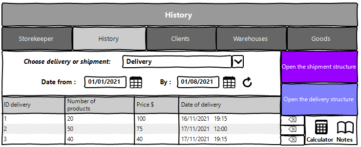

Pic. 2.1 View the history list.

<b>The list displays the following columns:</b>
* ID delivery – unique delivery or shipment number;
* Number of products - number of products delivery or shipment;
* Price $ - the price of all delivery or shipment;
* Date of delivery - shows the day on which the product was delivery;

<b>Filtering by date:</b>
* In the history list view mode, the administrator sets a 
filter by date and clicks the update list button 
(to the right of the date input field);
* The app will only show products during a certain 
delivery or shipment period;
* If an incorrect date range is specified, it displays 
an error message(pic. 2.1.1).
* In the current tab, you can also find out the 
current date and time there ;
* Also in this tab there is a calculator and a 
notepad for faster counting and writing, respectively

<b>Restrictions:</b>
* Start date of the period should be less than end date of the period;
* If start date is blank, then filtering by end date only.
* If end date is blank, then filtering by start date only.
* Updating data after selecting the filtering conditions 
is carried out by pressing the “Refresh” button.

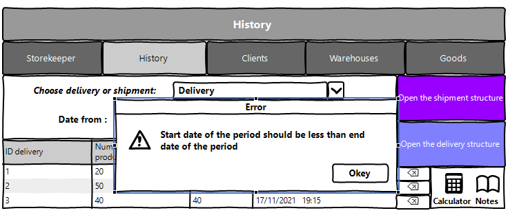

Pic. 2.1.1 Incorrect date.

### 2.2 Open the delivery structure

<b>Main scenario</b>:
* Administrator clicks the “Open the delivery structure” 
button in the history list view mode;
* Application displays form to choose code delivery  
(pic. 2.2);
* Administrator enters code delivery and presses "refresh"
button;
* A list of the delivery history with detailed 
information about it is displayed.

<b>Cancel operation scenario</b>:
* Administrator clicks the “Open the delivery structure” 
button in the history list view mode;
* Application displays form to choose code delivery;
* Administrator enters code delivery and presses "refresh"
button;
* If the administrator selects the menu item "Storekeeper", 
"History", "Clients","Warehouses" or "Goods" , 
we will exit the viewing mode.

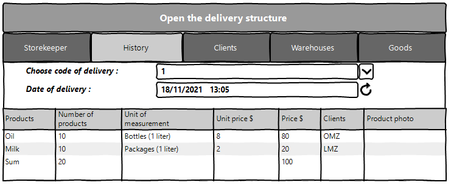

Pic. 2.2 Open the delivery structure.

<b>When selecting the delivery number, the following 
information is selected:</b>
* Code of delivery - product delivery number.

### 2.3 Open the shipment structure

<b>Main scenario</b>:
* Administrator clicks the “Open the shipment structure” 
button in the history list view mode;
* Application displays form to choose code shipment  
(pic. 2.3);
* Administrator enters code shipment and presses "refresh"
button;
* A list of the shipment history with detailed 
information about it is displayed.

<b>Cancel operation scenario</b>:
* Administrator clicks the “Open the shipment structure” 
button in the history list view mode;
* Application displays form to choose code shipment;
* Administrator enters code shipment and presses "refresh"
button;
* If the administrator selects the menu item "Storekeeper", 
"History", "Clients","Warehouses" or "Goods" , 
we will exit the viewing mode.

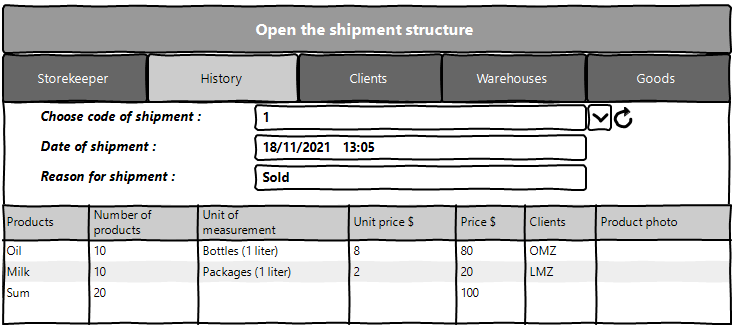

Pic. 2.3 Open the delivery structure.

<b>When selecting the delivery number, the following 
information is selected:</b>
* Code of delivery - product delivery number.

### 2.4 Removing History

<b>Main scenario:</b>
* The administrator, being in the history mode of the list 
of deliveries or shipments, presses the "Delete" button in the 
selected history line;
* Application displays confirmation dialog “What to do with this Delivery?”;
* The administrator confirms the removal of the history delivery or shipment;
* Record is deleted from database;
* If history record is successfully deleted, then list 
of history without deleted records is displaying.

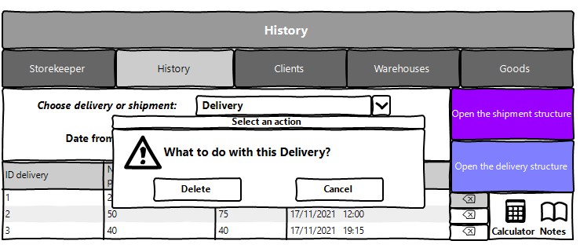

Pic. 2.4 Delete history dialog.

<b>Cancel operation scenario:</b>
* Administrator is in display mode of history list and press “Delete” button;
* Application displays confirmation dialog “What to do with this Delivery?”;
* Administrator press “Cancel” button;
* List of history delivery without changes is displaying.

## 3. Clients
### 3.1 Display list of clients

This mode is intended for viewing the clients list

<b>Main scenario:</b>
* User selects item “Clients”;
* Application displays list of clients.

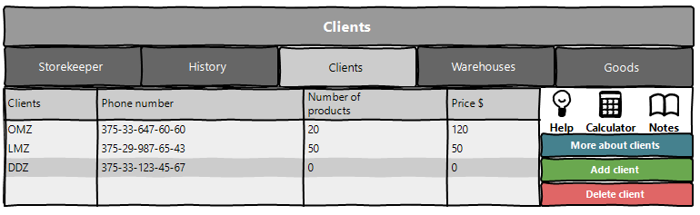

Pic. 3.1 View the clients list.

<b>The list displays the following columns:</b>
* Clients – client's name;
* Number of products - the number of products the clients has;
* Price $ - the price of all clients;
* Phone number - сommunication with the client.

### 3.2 More about clients

<b>Main scenario</b>:
* Administrator clicks the “More about clients” 
button in the clients list view mode;
* Application displays form to choose client's name  
(pic. 3.2);
* Administrator enters client's name;
* A list of the clients with detailed 
information about it is displayed.

<b>Cancel operation scenario</b>:
* Administrator clicks the “More about clients” 
button in the clients list view mode;
* Application displays form to choose client's name; 
* Administrator enters client's name;
* If the administrator selects the menu item "Storekeeper", 
"History", "Clients","Warehouses" or "Goods" , 
we will exit the viewing mode.

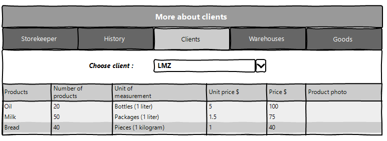

Pic. 3.2 Open more about clients.

<b>When selecting the client's name, the following 
information is selected:</b>
* Clients - client's name.

### 3.3 Add client

<b>Main scenario</b>:
* Administrator clicks the “Add client” 
button in the clients list view mode;
* Application displays form to enter client's name  
(pic. 3.3);
* Administrator enters client's name;
* A list of the clients with information about it is displayed.

<b>Cancel operation scenario</b>:
* Administrator clicks the “Add client” 
button in the clients list view mode;
* Application displays form to enter client's name; 
* Administrator enters client's name;
* If the administrator selects the menu item "Storekeeper", 
"History", "Clients","Warehouses" or "Goods" , 
we will exit the viewing mode.

Pic. 3.3 Add client.

<b>When selecting the client's name, the following 
information is selected:</b>
* Clients - client's name;
* Phone number - сommunication with the client.

### 3.4 Removing client

<b>Main scenario:</b>
* The administrator, being in the clients mode of the list 
of clients, presses the "Delete client" button;
* Application displays form to choose client's name ;
* Administrator should click the "update" 
button, which will display the number of products 
this customer has;
* Administrator confirms the removal of client;
* Record is deleted from database;
* If history record is successfully deleted, then list 
of clients with deleted records is displaying.

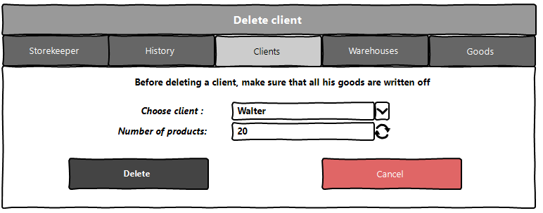

Pic. 3.4 Delete clients.

<b>Cancel operation scenario:</b>
* The administrator, being in the clients mode of the list 
of clients, presses the "Delete client" button;
* Application displays form to choose client's name ;
* The administrator should click the "update" 
button, which will display the number of products 
this customer has;
* Administrator press “Cancel” button;
* List of clients without changes is displaying.

<b>If the administrator tries to delete a client who still 
has a product, it will display the corresponding error.</b>

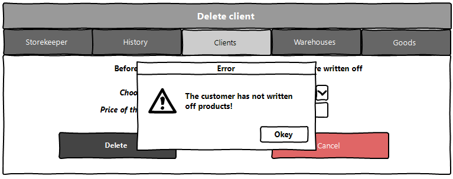

Pic. 3.4.1 Errors delete clients.

## 4. Warehouses
### 4.1 Display list of Warehouses

This mode is intended for viewing the warehouses list

<b>Main scenario:</b>
* User selects item “Warehouses”;
* Application displays list of warehouses.

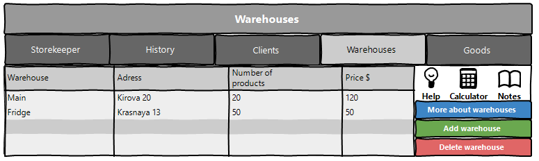

Pic. 4.1 View the warehouses list.

<b>The list displays the following columns:</b>
* Warehouse – name of the warehouse;
* Adress - warehouse location
* Number of products - the number of products the warehouse has;
* Price $ - the price of all warehouse.

### 4.2 More about warehouses

<b>Main scenario</b>:
* Administrator clicks the “More about warehouses” 
button in the warehouses list view mode;
* Application displays form to choose name of the warehouses  
(pic. 4.2);
* Administrator enters name of the warehouses;
* A list of the warehouses with detailed 
information about it is displayed.

<b>Cancel operation scenario</b>:
* Administrator clicks the “More about warehouses” 
button in the warehouses list view mode;
* Application displays form to choose name of the warehouses;
* Administrator enters name of the warehouses;
* If the administrator selects the menu item "Storekeeper", 
"History", "Clients","Warehouses" or "Goods" , 
we will exit the viewing mode.

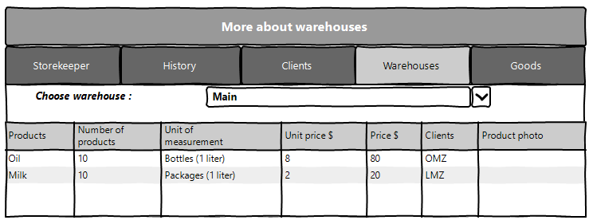

Pic. 4.2 Open more about warehouses.

<b>When selecting the name of the warehouses, the following 
information is selected:</b>
* Warehouse - name of the warehouses.

### 4.3 Add warehouse

<b>Main scenario</b>:
* Administrator clicks the “Add warehouse” 
button in the warehouse list view mode;
* Application displays form to enter warehouse name  
(pic. 4.3);
* Administrator enters warehouse name;
* A list of the warehouse with information about it is displayed.

<b>Cancel operation scenario</b>:
* Administrator clicks the “Add warehouse” 
button in the warehouse list view mode;
* Application displays form to enter warehouse name; 
* Administrator enters warehouse name;
* If the administrator selects the menu item "Storekeeper", 
"History", "Clients","Warehouses" or "Goods" , 
we will exit the viewing mode.

Pic. 4.3 Add warehouse.

<b>When selecting the warehouse name, the following 
information is selected:</b>
* Name of the warehouse - warehouse name;
* Adress - warehouse location.

### 4.4 Removing warehouse

<b>Main scenario:</b>
* The administrator, being in the warehouse mode of the list 
of warehouse, presses the "Delete warehouse" button;
* Application displays form to choose warehouse name;
* Administrator must click the "Update"
button, which will display the number of products
available in this warehouse;
* The administrator confirms the removal of warehouse;
* Record is deleted from database;
* If history record is successfully deleted, then list 
of warehouses with deleted records is displaying.

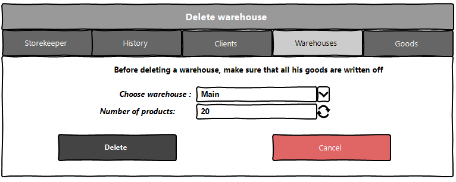

Pic. 4.4 Delete warehouse.

<b>Cancel operation scenario:</b>
* The administrator, being in the warehouse mode of the list 
of warehouse, presses the "Delete warehouse" button;
* Application displays form to choose warehouse name;
* Administrator must click the "Update"
button, which will display the number of products
available in this warehouse;
* Administrator press “Cancel” button;
* List of warehouses without changes is displaying.

<b>If the administrator tries to delete a warehouse that 
still has there is a product, it will display the 
corresponding error.</b>

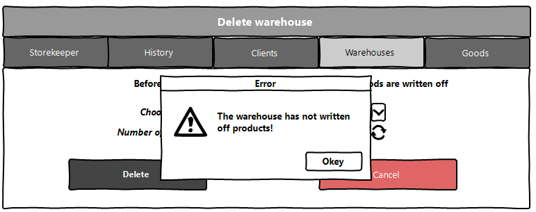

Pic. 4.4.1 Errors delete clients.

## 5. Goods
### 5.1 Display list of goods

This mode is intended for viewing the goods list

<b>Main scenario:</b>
* User selects item “Goods”;
* Application displays list of goods.

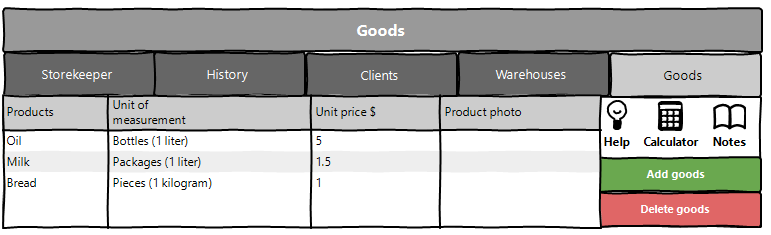

Pic. 5.1 View the goods list.

<b>The list displays the following columns:</b>
* Products - name of the products;
* Unit of measurement - in what value is our product measured;
* Unit price $ - price per product;
* Product photo - photos of our product.

### 5.2 Add goods

<b>Main scenario</b>:
* Administrator clicks the “Add goods” 
button in the goods list view mode;
* Application displays form to enter goods data  
(pic. 4.3);
* Administrator enters goods data;
* A list of the goods with information about it is displayed.

<b>Cancel operation scenario</b>:
* Administrator clicks the “Add goods” 
button in the goods list view mode;
* Application displays form to enter goods data; 
* Administrator enters goods data;
* If the administrator selects the menu item "Storekeeper", 
"History", "Clients","Warehouses" or "Goods" , 
we will exit the viewing mode.

Pic. 5.2 Add goods.

<b>When selecting goods the following 
information is selected:</b>
* Products - name of the products;
* Unit of measurement - in what value is our product measured;
* Unit price $ - price per product;
* Product photo - photos of our product.

### 5.3 Removing goods

<b>Main scenario:</b>
* The administrator, being in the goods mode of the list 
of goods, presses the "Delete goods" button;
* Application displays form to choose goods name;
* Administrator must click the "Update"
button, which will display the number of products
available;
* The administrator confirms the removal of goods;
* Record is deleted from database;
* If history record is successfully deleted, then list 
of goods with deleted records is displaying.

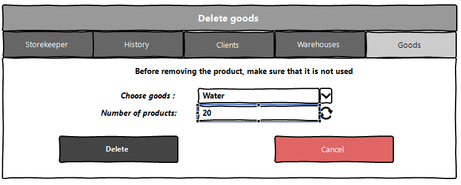

Pic. 5.3 Delete goods.

<b>Cancel operation scenario:</b>
* The administrator, being in the goods mode of the list 
of goods, presses the "Delete goods" button;
* Application displays form to choose goods name;
* Administrator must click the "Update"
button, which will display the number of products
available;
* Administrator press “Cancel” button;
* List of goods without changes is displaying.

<b>If the administrator tries to delete an item that is 
still in use, he will display the corresponding error.</b>

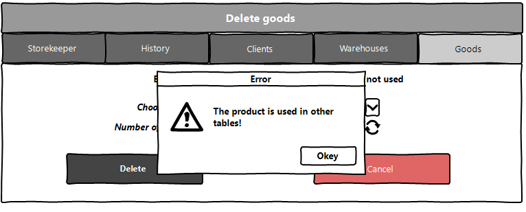

Pic. 5.3.1 Errors delete goods.
